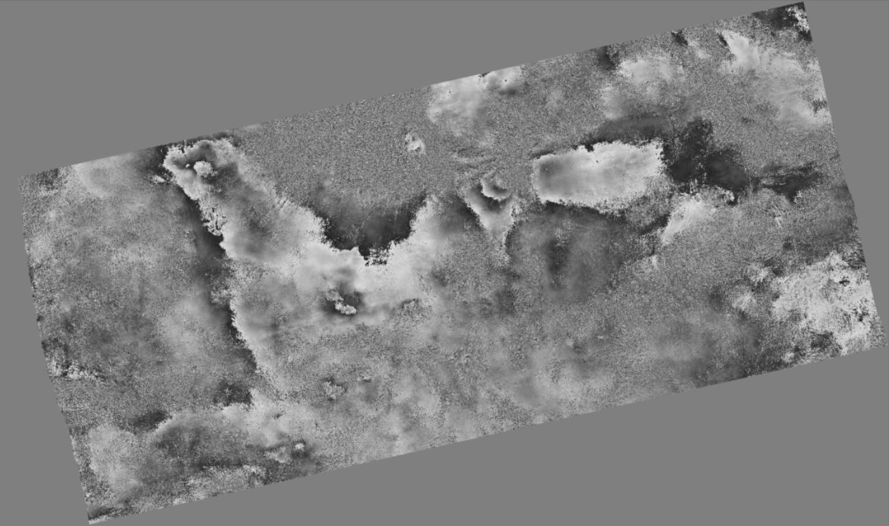
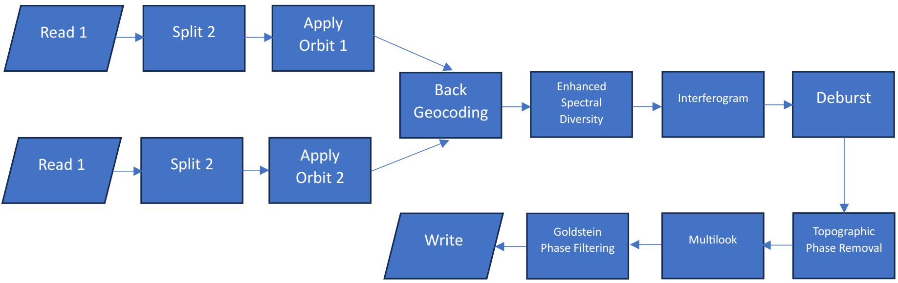
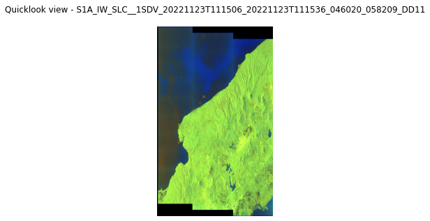
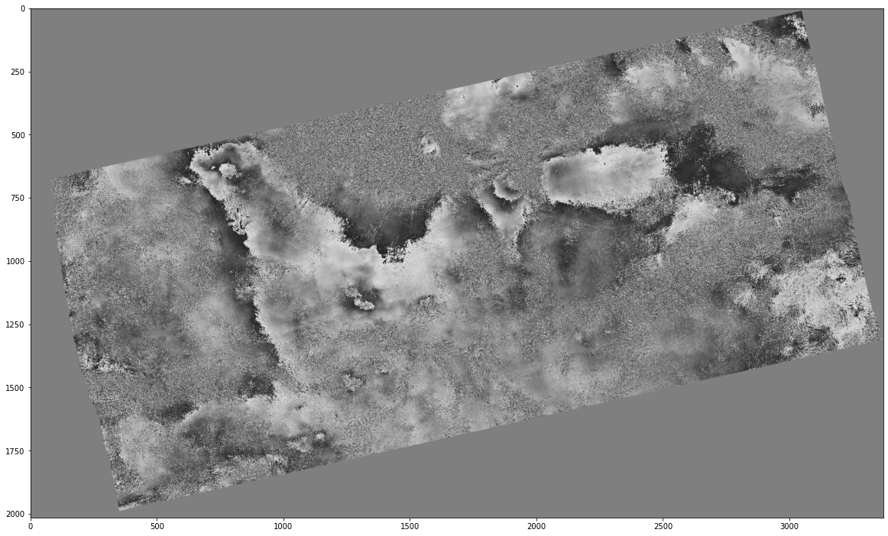

#  Cianjur 2022 Earthquake Interferogram Creation from Sentinel-1 Data 




On 21 November 2022, a magnitude 5.6 SR earthquake struck the city of Cianjur, West Java, Indonesia and the nearby areas.

The goal of this work is to provide interferogram created from a pair of Sentinel-1A satellite. Sentinel-1 has temporal resolution of 6 days, with 12 days repeat cycle at equator with one satellite. The first image was obtained 2 days after the earthquake (23 November 2022), and the second one was taken on 11 November 2022, about 12 days prior the first image.

In this exact case, python module from ESA SNAP called snappy is utilized to pre-process the data. ESA SNAP is a toolbox for processing and analysis of Earth Observation data. The snappy module is "python add-on" for SNAP and makes it possible to create automation for certain processes.


```python
import matplotlib.colors as colors 
import matplotlib.image as mpimg   
import matplotlib.pyplot as plt    
from termcolor import colored      #print colored text
from zipfile import ZipFile        #zip file manipulation
from os.path import join           #data access in file manager
from glob import iglob             #data access in file manager
import pandas as pd                
import numpy as np                 
import subprocess                  #external calls to system
import snappy                      #SNAP python interface
import jpy                         #python-java bridge
from PIL import Image

#change module settings
pd.options.display.max_colwidth = 90 #longer text in pandas dataframe
```

In the case of needing to know what operators available, it is possible to list them in snappy by calling gpt -h, while gpt -h *operator* will list the documentation of specific operator


```python
#print(subprocess.Popen(['gpt','-h'], stdout=subprocess.PIPE, universal_newlines=True).communicate()[0]) #use this for full list 
#print(subprocess.Popen(['gpt','-h','TOPSAR-Split'], stdout=subprocess.PIPE, universal_newlines=True).communicate()[0]) #use this for specific operator
```

# Workflow



Sentinel-1 has several products, Level 0 raw, Level 1 SLC (Single Look Complex), Level 1 GRD (Ground Range Detected), and Level 2 OCN ocean product.

For the purpose of producing interferogram that is useful for analysis in earthquake, Level 1 SLC is the one to be used.  

It has default acquisition mode over land called IW (Interferometric Wide Swath Mode) with TOPSAR (Terrain Observation with Progressive Scans SAR) technique and dual polarization (VV+VH). 

The TOPSAR technique images 3 sub swaths IW1, IW2, IW3 with total of 10 bursts for each sub. 

In general, the workflow goes as:

1. Read 1 and 2: each imagery needs to be read and be selected 
2. Split 1 and 2: then split by selecting the desired swath and bursts only
3. Apply Orbit 1 and 2 : will refine the orbit data for each imagery

4. Back Geocoding : coregistration based on the orbit information and additional information from a DEM (Digital Elevation Model)
5. Enhanced Spectral Diversity : calculate average constant range and azimuth offset estimation for the imagery, through estimation of each burst
6. Interferogram Creation : interferogram from two image-stacked product supplied from Back Geocoding and ESD
7. Deburst : deburst will remove the seamlines between single bursts
8. Topographic Phase Removal : removal of the topograhic phase by estimation and subtraction from the debursted interferogram
9. Multilook : reduce the speckle (salt and grain effect) noise that originally appears to SAR images and acquisition of square pixels 
10. Goldstein Phase Filtering : a phase filter by goldstein to further reduce the noise
11. Write : If desired, exporting to other format is also possible, for example as geotiff


```python
product_path = r"D:\Work\Deep Learning and Satellites\Cianjur_2022"
#input_files = sorted(list(iglob(os.path.join(product_path, "*.zip"), recursive=True))) #input all zip files without the ones inside the sub folder
input_files = sorted(list(iglob(join(product_path,"**", "*S1*.zip"), recursive=True))) #input all zip files including all inside the sub folder
    
name, sensing_mode, product_type, polarization, height, width, band_names = ([] for i in range(7))

for i in input_files:
    sensing_mode.append(i.split("_")[2])
    product_type.append(i.split("_")[3])
    polarization.append(i.split("_")[-6])
    #read using snappy
    data_read = snappy.ProductIO.readProduct(i)
    name.append(data_read.getName())
    height.append(data_read.getSceneRasterHeight())
    width.append(data_read.getSceneRasterWidth())
    band_names.append(data_read.getBandNames())
    
df_read = pd.DataFrame({'Name':name, 'Sensing Mode': sensing_mode, 'Product Type': product_type, 'Polarization': polarization, 'Height': height, 'Width': width, 'Band Names': band_names})
display(df_read)

# display quicklook.png that is the preview of the imageries located inside the zip files
# there are a pair, therefore two previews are displayed here
for i in range(len(input_files)):
    with ZipFile(input_files[i], 'r') as qlook:
        qlook = qlook.open(name[i] + '.SAFE/preview/quick-look.png')
        img = Image.open(qlook) #use PIL's Image
        
        plt.figure(figsize = (5,5))
        plt.title('Quicklook view - '+ name[i] + '\n')
        plt.axis('off')
        plt.imshow(img)
```


<div>
<style scoped>
    .dataframe tbody tr th:only-of-type {
        vertical-align: middle;
    }

    .dataframe tbody tr th {
        vertical-align: top;
    }

    .dataframe thead th {
        text-align: right;
    }
</style>
<table border="1" class="dataframe">
  <thead>
    <tr style="text-align: right;">
      <th></th>
      <th>Name</th>
      <th>Sensing Mode</th>
      <th>Product Type</th>
      <th>Polarization</th>
      <th>Height</th>
      <th>Width</th>
      <th>Band Names</th>
    </tr>
  </thead>
  <tbody>
    <tr>
      <th>0</th>
      <td>S1A_IW_SLC__1SDV_20221111T111506_20221111T111536_045845_057C1D_22C2</td>
      <td>IW</td>
      <td>SLC</td>
      <td>1SDV</td>
      <td>15030</td>
      <td>70307</td>
      <td>[i_IW1_VH, q_IW1_VH, Intensity_IW1_VH, i_IW1_VV, q_IW1_VV, Intensity_IW1_VV,...</td>
    </tr>
    <tr>
      <th>1</th>
      <td>S1A_IW_SLC__1SDV_20221123T111506_20221123T111536_046020_058209_DD11</td>
      <td>IW</td>
      <td>SLC</td>
      <td>1SDV</td>
      <td>15030</td>
      <td>70307</td>
      <td>[i_IW1_VH, q_IW1_VH, Intensity_IW1_VH, i_IW1_VV, q_IW1_VV, Intensity_IW1_VV,...</td>
    </tr>
  </tbody>
</table>
</div>


    

    


    

    


### TOPSAR-SPLIT

TOPSAR-SPLIT operator is useful to select specific bursts that is included for the analysis, this will affect for the reduction of processing time (instead of using full imagery which will be longer in overall processing time)

Sentinel-1 IW has 1-10 bursts. For this Cianjur interferogram creation case, only burst 7-8 selected to save processing time and basically chose the region of interest


```python
def topsar_split(raster):

    parameters = snappy.HashMap()
    parameters.put('firstBurstIndex',7)
    parameters.put('lastBurstIndex',8)
    parameters.put('subswath', 'IW2')
    parameters.put('selectedPolarisations', 'VV')
    top_split = snappy.GPF.createProduct('TOPSAR-Split', parameters, raster)

    print("Split done")
    return top_split

#image1 = snappy.ProductIO.readProduct(S1B_IW_SLC__1SDV_20210209T072955_20210209T073025_025526_030AA1_1D17.zip)
#topsar_1 = topsar_split(input_files[0])
img_tmp1 = input_files[0].split("\\")[-1]
img1 = snappy.ProductIO.readProduct(img_tmp1)

topsar_1 = topsar_split(img1)

img_tmp2 = input_files[1].split("\\")[-1]
img2 = snappy.ProductIO.readProduct(img_tmp2)

topsar_2 = topsar_split(img2)
```

    Split done
    Split done


### Apply Orbit File

An operator to refine orbit data in order to provide accurate satellite position and velocity information


```python
def apply_orbit(raster):

    parameters = snappy.HashMap()
    parameters.put('Apply-Orbit-File', True)
    apply_orbit_file = snappy.GPF.createProduct('Apply-Orbit-File', parameters, raster)

    print("Apply Orbit File done")
    return apply_orbit_file


apply_orbit1 = apply_orbit(topsar_1)
apply_orbit2 = apply_orbit(topsar_2)
```

    Apply Orbit File done
    Apply Orbit File done


### Back Geocoding

Back geocoding will perform coregistration based on the orbit information and additional information from a DEM (Digital Elevation Model)


```python
parameters = snappy.HashMap()
parameters.put('demName', "SRTM 1Sec HGT")
parameters.put('demResamplingMethod', 'BICUBIC_INTERPOLATION')
parameters.put('resamplingType', 'BISINC_5_POINT_INTERPOLATION')
parameters.put('maskOutAreaWithoutElevation', True)
parameters.put('outputDerampDemodPhase', True)

sett = []
sett.append(apply_orbit1)
sett.append(apply_orbit2)

back_geocoded = snappy.GPF.createProduct('Back-Geocoding', parameters, sett) 
print("back geocoding done")
```

    back geocoding done


### Enhanced Spectral Diversity

ESD operator will calculate average constant range and azimuth offset estimation for the imagery, through estimation of each burst


```python
parameters = snappy.HashMap()
parameters.put('Enhanced-Spectral-Diversity', True)
esd = snappy.GPF.createProduct('Enhanced-Spectral-Diversity', parameters, back_geocoded)
print("Enhanced Spectral Diversity done")
```

    Enhanced Spectral Diversity done


### Interferogram Creation

This operation marks the creation of the interferogram from two image-stacked product supplied from Back Geocoding and ESD from the previous steps


```python
parameters = snappy.HashMap()
parameters.put('cohWinRg', 20)
interferogram = snappy.GPF.createProduct('Interferogram', parameters, esd) 
print("Interferogram Creation done")
```

    Interferogram Creation done


### Deburst

There are visible seamline between bursts from Sentinel-1 Interferometric Wide Swath product. Deburst will remove the seamlines between single bursts


```python
parameters = snappy.HashMap()
parameters.put('selectedPolarisations', 'VV')
debursted = snappy.GPF.createProduct('TOPSAR-Deburst', parameters, interferogram) 
print("Deburst done")

#a way to get list of the bands is :
#bands = list(debursted.getBandNames())
#bands

#ifg_VV = debursted.getBand('Phase_ifg_IW2_VV_23Nov2022_11Nov2022')
#w = ifg_VV.getRasterWidth()
#h = ifg_VV.getRasterHeight()
#ifg_VV_data = np.zeros(w * h, np.float32)
#ifg_VV.readPixels(0, 0, w, h, ifg_VV_data)
#debursted.dispose()
#ifg_VV_data.shape = h, w
#plt.imshow(ifg_VV_data)
```

    Deburst done


### Topographic Phase Removal

Removal of the topograhic phase by estimation and subtraction from the debursted interferogram


```python
parameters = snappy.HashMap()
parameters.put('demName', "SRTM 1Sec HGT")
parameters.put('outputTopoPhaseBand', True)
topo_remove = snappy.GPF.createProduct('TopoPhaseRemoval', parameters, debursted) 
print("Topographic Phase Removal done")
```

    Topographic Phase Removal done


### Multilook

Multilook will reduce the speckle (salt and grain effect) noise that originally appears to SAR images and acquisition of square pixels 


```python
parameters = snappy.HashMap()
parameters.put('nRgLooks', 8)

multilook = snappy.GPF.createProduct('Multilook', parameters, topo_remove) 
print("Multilook done")
```

    Multilook done


### Goldstein Phase Filtering

A phase filter by goldstein to further reduce the noise


```python
parameters = snappy.HashMap()
parameters.put('GoldsteinPhaseFiltering', True)
filtered = snappy.GPF.createProduct('GoldsteinPhaseFiltering', parameters, multilook)
print("Goldstein Phase Filtering done")
```

    Goldstein Phase Filtering done


### Geometric/Terrain Correction

Apply geometric or terrain correction to the filtered image, so that the it has correct coordinate system. Useful if the imagery is desired to be plotted on web app , this is possible with folium or leaflet for example


```python
parameters = snappy.HashMap()
parameters.put('demName', "SRTM 1Sec HGT")
parameters.put('demResamplingMethod', 'BICUBIC_INTERPOLATION')
parameters.put('imgResamplingMethod', 'BICUBIC_INTERPOLATION')
parameters.put('sourceBands', 'Intensity_ifg_VV_23Nov2022_11Nov2022_db, Phase_ifg_VV_23Nov2022_11Nov2022, topo_phase_VV_23Nov2022_11Nov2022, coh_IW2_VV_23Nov2022_11Nov2022')
parameters.put('saveSelectedSourceBand', True)
TC = snappy.GPF.createProduct('Terrain-Correction', parameters, filtered) 
print("Terrain Correction done")

bandsTC = list(TC.getBandNames())
bandsTC
```

    Terrain Correction done


    ['Intensity_ifg_VV_23Nov2022_11Nov2022_db',
     'Phase_ifg_VV_23Nov2022_11Nov2022',
     'topo_phase_VV_23Nov2022_11Nov2022',
     'coh_IW2_VV_23Nov2022_11Nov2022']


### Plot the Geometrically Corrected Interferogram

A simple plot to show the geometrically corrected and filtered interferogram


```python
#after running this code, it will take a while before the image appears
ifg_VV = TC.getBand('Phase_ifg_VV_23Nov2022_11Nov2022')
w = ifg_VV.getRasterWidth()
h = ifg_VV.getRasterHeight()
ifg_VV_data = np.zeros(w * h, np.float32)
ifg_VV.readPixels(0, 0, w, h, ifg_VV_data)
#debursted.dispose()
ifg_VV_data.shape = h, w
plt.figure(figsize = (20,15))
plt.imshow(ifg_VV_data,cmap='gray',vmin=-3.964,vmax=3.997)

```


    <matplotlib.image.AxesImage at 0x2480dcd5518>


    

    


### Write/Export to Other formats

If desired, exporting to other format is also possible. The example below shows how to export the product in geotiff format: 


```python
outname = r"D:\Work\Deep Learning and Satellites\Cianjur_2022\outname"
snappy.ProductIO.writeProduct(TC,outname,'geoTIFF')
print("successfully written !")
```

    successfully written !


```python

```

### Result Analysis

Sentinel-1 is a C-Band synthetic aperture radar imaging constellation. This makes the penetration capability in dense vegetation area expected to be not reliable, where it was shown by the small numbers of the interferogram fringes formed from the pair of the SAR imagery. The area around city of Cianjur is a dense and abundant with vegetations, due to the fact that it is a mountainous region, with Mount Gede-Pangrango northeast the city, alongside with other smaller hills surrounding the city (on other directions). The magnitude of the earthquake itself is around 5.6 SR where it is quite the bare minimum for the interferogram to be well formed. Therefore, for a C-Band constellation, having to be able to formed visible interferogram on the site of the earthquake with several reasoning explained previously, this is quite a good result. The hypothesis would be with longer wavelength band instrument (L-Band for example) the detection of the earthquake in dense vegetations (or more likely on tropical region) is expected to be much better, providing the ionospheric conditions at the time of recording also quite good.
